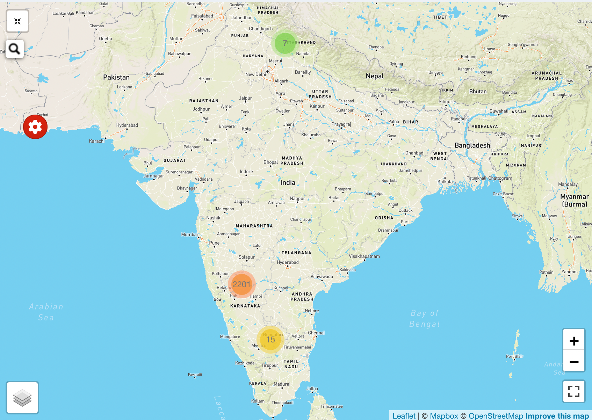
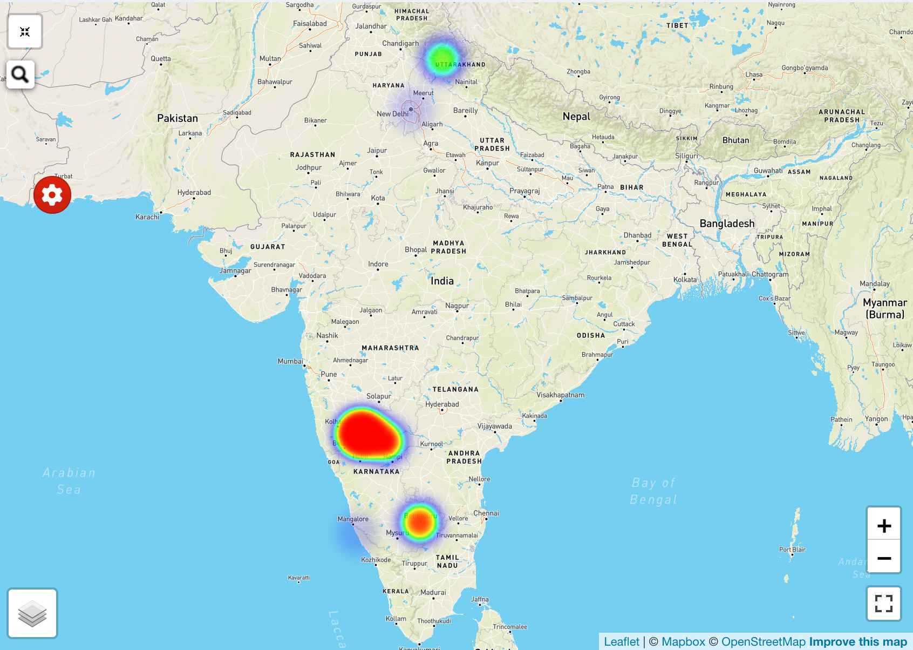
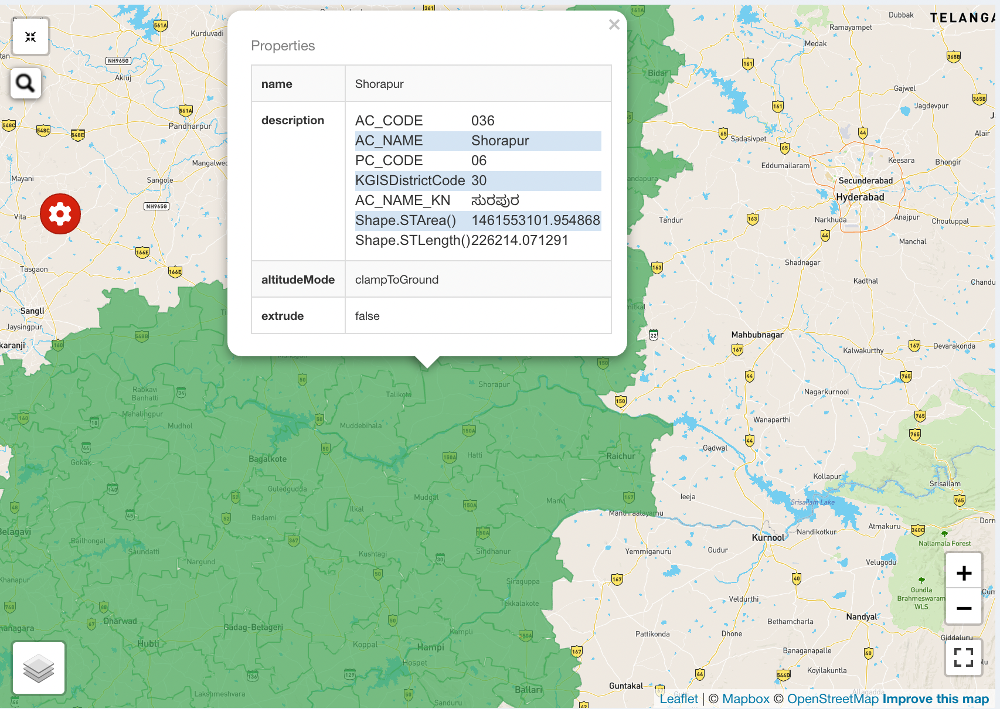

# Visualize the data using R and Leaflet

This project is to showcase the potential of R and Leaflet to show the users how can we visualize the data
using Maps. Features which we have worked on is 

1. Clustering

2. Heatmap

3. GeoJson Boundaries

4. Integration with Google Search
5. Integration with Mapbox
6. Filters
7. Shiny UI

## Installation Steps

- Install [R](https://cran.r-project.org)
- Install [Rstudio](https://www.rstudio.com/products/rstudio/download)

## Online resources 

- Getting Started with [R](https://www.dataquest.io/blog/tutorial-getting-started-with-r-and-rstudio/)
- [R documentation](https://www.rdocumentation.org/search?q=fluidRow)
- [Leafletjs documentation](https://leafletjs.com/)
- [Community blogs](https://www.r-bloggers.com/)
- [Mobile View](https://shiny.rstudio.com/articles/reconnecting.html)

## Tutorial Videos

- [Create your first Shiny App in R using Leaflet](https://www.youtube.com/watch?v=IQfsHnUYrFo)
- [Adding image to a map pointer](https://community.rstudio.com/t/add-different-pictures-to-each-markers-in-the-leaflet-package-map-application/128689/4)
- [Adding custom map pointer](https://www.jla-data.net/eng/leaflet-markers-in-r/)
- [Clustering Map pointer](https://gis.stackexchange.com/questions/241158/displaying-sum-of-frequencies-in-leaflet-cluster-maps-pointer)

## Other videos to explore

- Brief Overview of [R shiny](https://www.youtube.com/watch?v=6o7jNUXUONY) good to see what the full-scale map would look like. In this video, it will show the map view of earthquakes based on their magnitude and location
- [Getting started with R and RStudio:](https://www.youtube.com/watch?v=lVKMsaWju8w) good to get familiar with terminal and console

